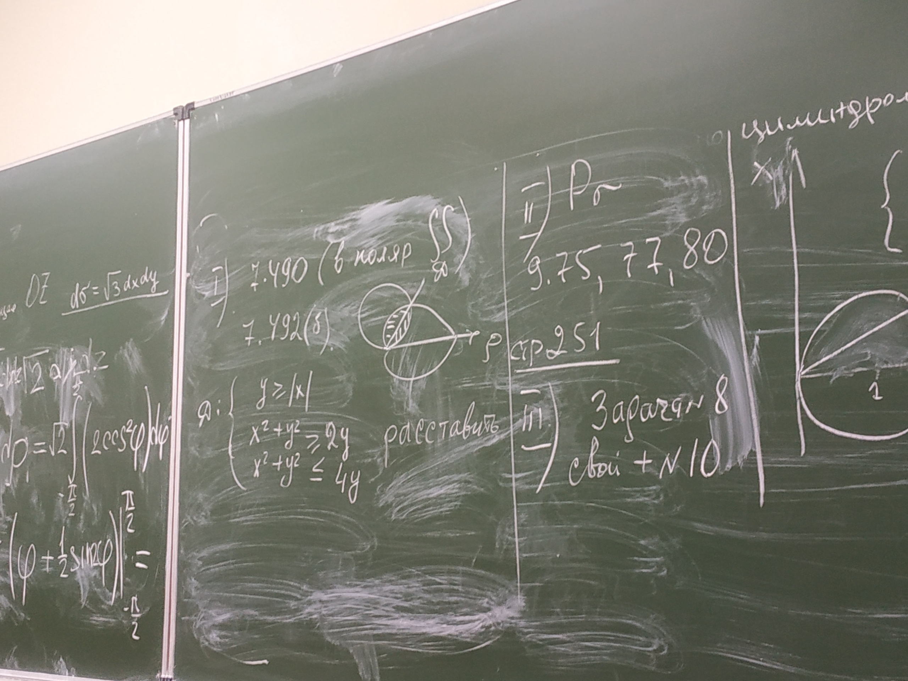

# Список текущего и будущего дз

## Быстрый переход

- [Текущее дз](README.md#Список-текущего-и-будущего-дз)
- [Архив дз (1 сем)](Дз_1_семестр.md#Список-старого-дз-за-1-семестр.)
- [Архив дз (2 сем)](Дз_2_семестр.md#Список-старого-дз-за-2-семестр.)
- [Инструкция по добавлению дз](Как_вам_добавлять_сюда_дз/Как_добавить_дз.md)
- [Информация по пересдачам](пересдачи.md)

***

- [Алгебра и геометрия](#Алгебра-и-геометрия)
- [Английский язык](#Английский-язык)
- [Дискретная математика](#Дискретная-математика)
- [Математический анализ](#Математический-анализ)
- [Методы математического анализа](#Методы-математического-анализа)
- [Научно-исследовательская работа](#Научно-исследовательская-работа-НИР)
- [Объектно-ориентированное программирование](#Объектно-ориентированное-программирование-ООП)
- [Основы алгоритмики](#Основы-алгоритмики)
- [Правоведение](#Правоведение)
- [Физическая культура и спорт](#Физическая-культура-и-спорт)

***
    
- [Условные обозначения](#Условные-обозначения)

***

## Другая информация

- __*["Наследие ПМИ"](https://github.com/appliedMathematicsAndComputerScience/PMI_legacy) теперь теперь доступно для всех. По-возможности - указывайте на ошибки и дополняйте.*__
-  __*Задния типовых расчётов в папке [Типовики](https://github.com/nektonick/KMBO-01-homework/tree/master/%D0%A2%D0%B8%D0%BF%D0%BE%D0%B2%D0%B8%D0%BA%D0%B8)*__
- __*Поддержать автора можно [донатом](https://www.tinkoff.ru/rm/grebnev.nikita7/9UP5Q99768).*__

***

- ### Алгебра и геометрия 
    #### Текущее
    - Досылайте исправленный ТР    
    - [Ефимов-Поспелов том 1](Книги/Ефимов_Поспелов_Сборник_задач_по_математике_том_1.pdf) номера **(3.) 135-138, 140-143**  

    [<< к началу](#Быстрый-переход)

- ### Английский язык:
    #### Текущее
    - Упражнения:
      - [Учебник "Английский для инженеров. Полякова"](https://github.com/appliedMathematicsAndComputerScience/PMI_legacy/blob/master/1%20%D0%BA%D1%83%D1%80%D1%81/2-%D0%BE%D0%B9%20%D1%81%D0%B5%D0%BC%D0%B5%D1%81%D1%82%D1%80/%D0%90%D0%BD%D0%B3%D0%BB%D0%B8%D0%B9%D1%81%D0%BA%D0%B8%D0%B9%20%D1%8F%D0%B7%D1%8B%D0%BA/%D0%90%D0%BD%D0%B3%D0%BB%D0%B8%D0%B9%D1%81%D0%BA%D0%B8%D0%B9%20%D0%B4%D0%BB%D1%8F%20%D0%B8%D0%BD%D0%B6%D0%B5%D0%BD%D0%B5%D1%80%D0%BE%D0%B2.%20%D0%9F%D0%BE%D0%BB%D1%8F%D0%BA%D0%BE%D0%B2%D0%B0.pdf) стр. 415 №11 - фото задания также есть в беседе
    - Переводы текстов
      - текст 8C
    - Устные сообщения (топики) на темы:
      - Global warming (или другое про экологию и т.д.)
      - The future of engineering (или про нанотехнологии, эргономику и т.д.)
      - Automobile Dependency (или связанное)
    - При устных сообщениях можно выступать группами.
    - *Опционально:* разное дз в СДО, о котором не написано тут
    
    [<< к началу](#Быстрый-переход)
    
    
- ### Дискретная математика:
    - Дз публикуется в [группе в телеграмме](https://t.me/joinchat/H2C6xYWNUwI07E5D)  
    - [Таблица успеваемости](https://docs.google.com/spreadsheets/d/17HMX-D0ettkm7mfQOLKDkYsT3Yi7FvsxfWhwNgDI6ys/edit#gid=0)
    - Временами будет проверка сделанного дз в тетради - можно получить за него плюсики (должно быть сделано больше половины задач)
    - [Диск с лекциями](https://drive.google.com/drive/folders/1cFywUQoRWgOEfyCtY3Tev0RE9xvpJTtz)
    #### Текущее 
    - [Дз 8] (Ресурсы/Документы/hw8.pdf) - ещё не скинули
    - Дз в тетрадях проверят на следующей паре

    [<< к началу](#Быстрый-переход)

- ### Математический анализ:
    #### Текущее
    - [Ефимов-Поспелов том 2](Книги/Ефимов_Поспелов_Сборник_задач_по_математике_том_2.pdf) номера **(7.) 490(в поляр), 492(б); (9.) 75,77,80**
    - **Типовой расчёт:**
      - [Это ссылка на файл ТР в наследии ПМИ](https://github.com/appliedMathematicsAndComputerScience/PMI_legacy/blob/master/1%20%D0%BA%D1%83%D1%80%D1%81/2-%D0%BE%D0%B9%20%D1%81%D0%B5%D0%BC%D0%B5%D1%81%D1%82%D1%80/%D0%9C%D0%B0%D1%82%D0%B5%D0%BC%D0%B0%D1%82%D0%B8%D1%87%D0%B5%D1%81%D0%BA%D0%B8%D0%B9%20%D0%B0%D0%BD%D0%B0%D0%BB%D0%B8%D0%B7/%D0%97%D0%B0%D0%B4%D0%B0%D0%BD%D0%B8%D1%8F%20%D1%82%D0%B8%D0%BF%D0%BE%D0%B2%D0%BE%D0%B3%D0%BE%20%D1%80%D0%B0%D1%81%D1%87%D0%B5%D1%82%D0%B0/Tr_ma2s-e.pdf)
      - Задача номер 8 в черновике
      - Делаем ***ваш вариант*** и ***ваш вариант + 10*** 
      - ***Ваш вариант*** определяем по специальному **списку Громовой**, который я кидал в беседу вк.
    - Задачи на неопределённые интегралы из "домашней контрольной работы" (10 примеров) переписываем на чистовик, у кого всё верно, должники вроде знают, что им делать
    - И остальное с фотки 
    
       

    [<< к началу](#Быстрый-переход) 
    
- ### Методы математического анализа:
    #### Текущее
    - Кажется, всё дз будет в разделе матана

    [<< к началу](#Быстрый-переход)

- ### Объектно-ориентированное программирование (ООП):
    - [Таблица успеваемости](https://yadi.sk/i/nlS1gRgAnpLtsQ)
    #### Текущее
    - *опицонально:* почитать про адресную арифметику в [учебнике Подбельского](https://online-edu.mirea.ru/pluginfile.php?file=%2F689864%2Fmod_resource%2Fcontent%2F1%2F%D0%9F%D0%BE%D0%B4%D0%B1%D0%B5%D0%BB%D1%8C%D1%81%D0%BA%D0%B8%D0%B9%20%D0%92.%20%D0%92.%20-%20%D0%AF%D0%B7%D1%8B%D0%BA%20%D0%A1%D0%B8%2B%2B.%205-%D0%B5%20%D0%B8%D0%B7%D0%B4.%2C%202003.djvu) (ссылка с СДО)
    - [Практическая работа 3](https://disk.yandex.ru/i/BokA3ixZocBCQA)
    - [Практическая работа 4](https://disk.yandex.ru/i/DZIIsU0kU_vW2w)
    - *Опционально:* в файле с пары доделать 
      - вывод мытрицы в файл (в служебном виде - размеры, элементы), 
      - чтение матрицы из файла с переопределением текущих размеров
        - можно это сделать отдельным конструктором, принимающим в качестве параметра файловый поток

    [<< к началу](#Быстрый-переход)

- ### Основы алгоритмики:
    #### Текущее
    - Дз, семинары и лекции находятся [ТУТ](https://github.com/Vibof/ProgrammingManual_part2)
    - **Скинуть мне(старосте) ссылку на репозиторий с дз. Можете использовать старый репозиторий, предварительно всё из него удалив, но лучше создать новый.**
    - Сделанные задачи заливаем в ваш репозиторий на гитхабе

    [<< к началу](#Быстрый-переход)

- ### Научно-исследовательская работа (НИР):
    - [Таблица успеваемости](https://yadi.sk/i/JZfIHtwcLMeGaA)
    - Ваш вариант - номер по списку.
    - [Пример оформления задач](https://yadi.sk/i/eVXJq10--d83Lg)
        - Отчёты можно делать в Word, LaTex, LibreOffice
    #### Текущее
    - Делаем отчёты по **всем** задачам (это значит, что по 1 и 2 тоже надо)
    - [Практическое задание 4](https://yadi.sk/i/v4wvUGJlJxhyRA)
      - Это задание лучше всего делать в [Jupyter Notebook](https://jupyter.org/), использую [python(Anaconda)](https://www.anaconda.com/products/individual)
      - На оценку "4" - использование RandomForest без перебора параметров
      - На оценку "5" - подбор наилучших параметров "случайного леса" вручную или с помощью `GridSearch` (смотри лекцию 6 и [доп-материалы](https://disk.yandex.ru/d/gL-M8kNr5k9a4g))

    [<< к началу](#Быстрый-переход)

- ### Правоведение:
    #### Текущее
    К семинару 3:
    - выписать этапы принятия законов (`"законопроект" -> "закон"`) (статьи 104-107 конституции)
      - кто может вносить
      - порядок внесения
    - *Для доп.баллов:* (подробнее смотри на СДО)
      -  Найти материал о 5 юристах. На полстраницы о каждом. Всех времен и народов.(5 баллов)
      - [Любые 5 задач по наследству](https://online-edu.mirea.ru/mod/resource/view.php?id=219357)
      -  Сделать словарь юридических терминов. Любых, нужных и полезных вам. 50 слов с пояснениями. Можно от руки в тетради или напечатать. Материал брать с помощью любого поисковика на юридических сайтах. (10 баллов).
      - 5 ответов на [вопросы из зачета](https://online-edu.mirea.ru/mod/resource/view.php?id=219407)
      -  Можно посмотреть видеотрансляции из залов суда (на сайтах любых судов есть архив). Можно составить краткий отчет. Где и что видели. Главное уловить последовательность ведения судебных слушаний. Это 10 баллов.
    
    
    [<< к началу](#Быстрый-переход)

- ### Физическая культура и спорт:
    #### Текущее

    [<< к началу](#Быстрый-переход)

# Условные обозначения

- [ ] `Текущее дз`

`(?) - непроверенная информация`

> [<< к началу](#Быстрый-переход)
