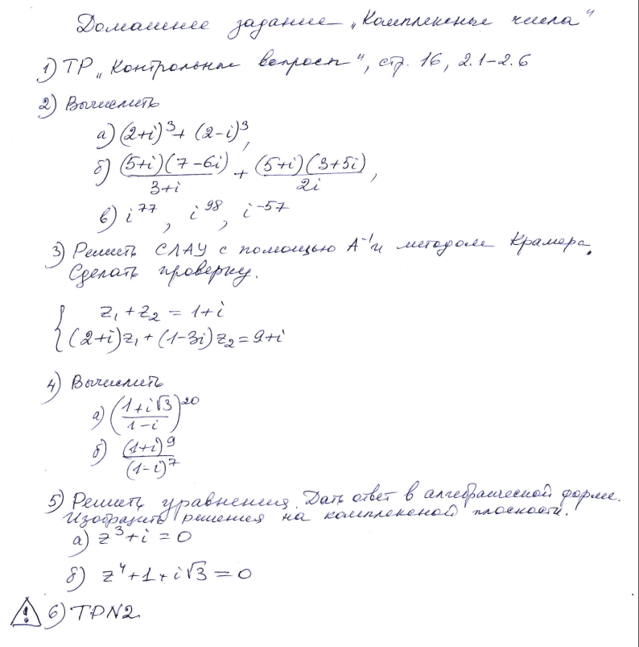

# Список текущего и будущего дз.
## __*Старое дз переехало [сюда](архив_дз.md).__
## __*Типовые расчёты в папке "Типовики"__

- ### История:
    #### Текущее
    - [ ]Залить свою презентацию в систему сдо
	- [ ] презентации (можно залить на гугл-диск(ссылка в беседе)), имя файла в формате `Номер_из_таблицы Тема_из_таблицы Фамилия"` - можно скопировать строку гугл-таблицы целиком и вставить в имя файла.

- ### Основы алгоритмики:
    #### Текущее
    - [ ] Создать на гитхабе репозиторий и скинуть мне ссылку на него.
	- [ ] Заливать на гитхаб сделанные задачи ([Cписок задач для решения](https://github.com/Vibof/ProgrammingManual))

- ### Английский язык:
    #### Текущее
    - [ ] Слова (либо вместо них можно сделать групповой проект - см. ниже).
        [Документ со словами](words.md), [оригинальный файл](unit3.docx) и [карточки](https://quizlet.com/ru/542944148/unit-3-flash-cards/?new)
    - [ ] Групповые проекты (презентация/сайт/ и т.д.) про климат/природу/флору и фауну России - не забыть вписать фамилии студентов и группу
    - [ ] До 30 ноября 2 тема из СДО - `грамматика`, и вся 3-я тема в СДО. `Задания 14, 22, 24, 29 стр 52 перевод 3 B (4а) (?)`
    - Рекомендации по заданиям и ответы можно посмотреть [ТУТ](дистанционный_английский.md).
         

- ### Алгебра и геометрия 
    #### Текущее
    - [ ] В [папке для типовых](https://drive.google.com/drive/folders/1yZzDBosCA-goPjwXN5-GJYDGfdrk-nsD?usp=sharing) создать папку со своей фамилией и именем. До 5 ноября залить туда 2-ое задание типовика. Название файла в формате `ТР №2 Вар 21 (05.11.20)`, где 05.11.20 - дата, на которую нужно было сделать данное задание.
    - [ ] Основное задание:

        
    - [ ] Дополнительно*: вывод sin(3x), cos(3x) через комплексные числа

- ### Алгебра и геометрия ФДЗ:
    #### Текущее
    - [ ] Тут пока ничего нет `*-*`
	
- ### Основы программирования (список лабораторных)
    - Список лабараторных на фотографиях. В 9) вместо слово "линейный" - бинарный.  
    - Если вы сдаёте в нужную неделю, то ставят 100%. На следующую вроде как тоже 100% (?). Потом каждый раз балл снижается.
    
    #### Текущее
    - [ ] 5, 6 (?) лаба.
        
        
	
- ### Мат.анализ и методы мат.анализа (Костин):
    #### Текущее
    - [ ] (1.) 195-197 - только канонич.
    - [ ] (1.) 200, 201, 203-211
    - [ ] Типовики Костину лучше сдавать заранее (можно по одному номеру)

- ### Дискретка:
    - [ ] Начать делать типовой расчёт. (Задание 2 из него разобрали на семинарах)
    - [ ] Исходя из материала семинара: определить количество кусочно непрерывных функций. 
    - [ ] Подумать над тем, что бы мы хотели разобрать в след.раз.
	
    
# Условные обозначения
- [ ] `Текущее дз`
- - `Дз на после-следующие занятие`

`(?) в тексте выражает неуверенность в том, что находится до этого.`
`; в номерах используется вместо записи "с новой строки" - обычно используется для разделения по темам. `