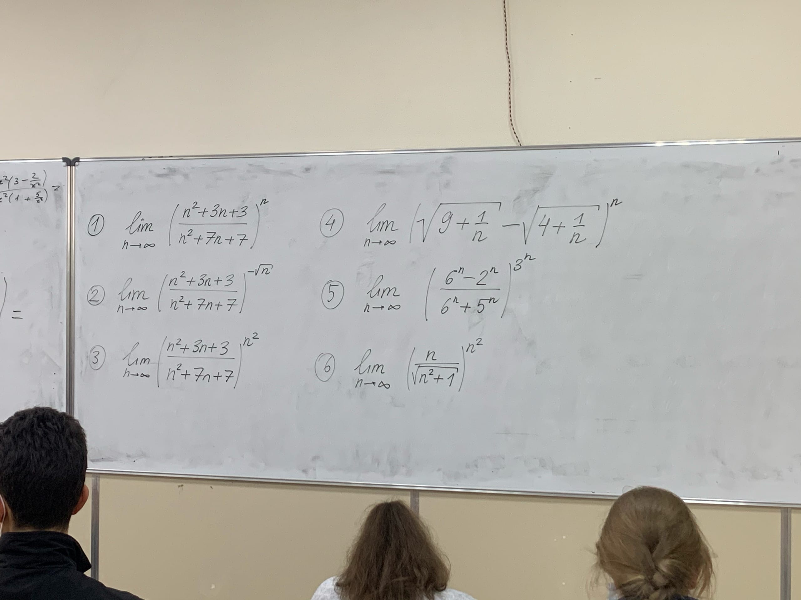

# Общий список дз

- ### История:
    #### Текущее
	- [ ] презентации к 16 октября заливаем на гугл диск (ссылка в беседе), имя файла в формате `Номер_из_таблицы Тема_из_таблицы Фамилия"` - можно скопировать строку гугл-таблицы целиком и вставить в имя файла.
- ### Основы алгоритмики:
    #### Текущее
	- [ ] задачи из репозитрия https://github.com/Vibof/ProgrammingManual
- ### Английский язык:
    #### Старое
    - [x] топик про мирэа
    - [x] стр 22 №36-40 
    - [x] выучить незнакомые слова https://quizlet.com/ru/528758443/unit-1-flash-cards/?new
    #### Текущее
    - [ ] топик про "высшее образование за границей" - страна на выбор
    #### Будущее
    - Слова из втрого юнита
- ### Алгебра и геометрия 
    #### Старое
	- [x] Ефимов (2.)76-86, 90-95, 163-165
    #### Текущее
    - [ ] Ефимов (2.)40-45; 1-3, 9; 12, 13, 16, 19, 21; 55, 56, 57(*мне неизвестно, 2 способа нужно только для 57 или для 55-57*); 67*, 68*; 29, 30, 54(б,в) 
- ### Алгебра и геометрия ФДЗ:
    #### Старое
    - [x] см. фото печатного листа

        

    #### Текущее
    - [ ] (2.)55-57, 61, 62

	
- ### Основы программирования (список лабораторных)
    - Список лабараторных на фотографиях. В 9) вместо слово "линейный" - бинарный.  

        
        
    - Если вы сдаёте в нужную неделю, то ставят 100%. На следующую вроде как тоже 100% (?). Потом каждый раз балл снижается.
    #### Текущее
    - 5, 6 (?) лаба.
	
- ### Мат.анализ и методы мат.анализа (Костин):
    #### Старое
	- [x] Ефимов, Поспелов (5.) 231-242, 244,245, 247-250
    - [x] Ефимов, Поспелов (1.) 80, 82, 83, 65-68, 70-73, 78, 79, 87-89, 75*, 77*  
    #### Текущее
    ***В тетради для типовых расчётов(?):***
	- [ ] Сделать №1 из типового расчёта своего варианта (типовые скинут на почту. наверное)
    - [ ] Задачи на фото 
- ### Дискретка:
    #### Старое
	- [x] мат.индукция - задачи с листа

        
    
# Условные обозначения
- [x] `Дз, которое надо было сделать`
- [ ] `Текущее дз`
- - `Дз на после-следующие занятие`

`(?) в тексте выражает неуверенность в том, что находится до этого.`
`; в номерах используется вместо записи "с новой строки" - обычно используется для разделения по темам. `