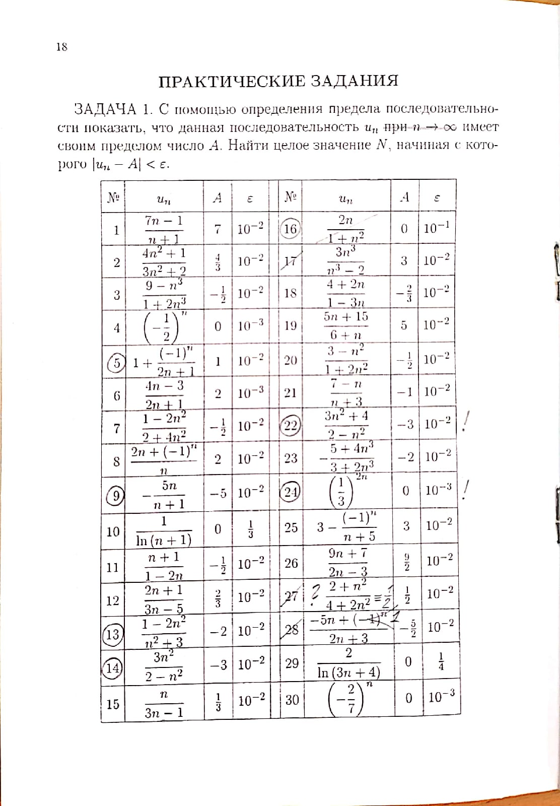

# Список старого дз.
- ### Английский язык:

    - [x] топик про мирэа
    - [x] стр 22 №36-40 
    - [x] выучить незнакомые слова https://quizlet.com/ru/528758443/unit-1-flash-cards/?new
    - [x] топик про "высшее образование за границей" - страна на выбор

- ### Алгебра и геометрия 
    - [x] Ефимов (2.)76-86, 90-95, 163-165
    - [x] Ефимов (2.)40-45; 1-3, 9; 12, 13, 16, 19, 21; 55, 56, 57(*мне неизвестно, 2 способа нужно только для 57 или для 55-57*); 67*, 68*; 29, 30, 54(б,в) 

- ### Алгебра и геометрия ФДЗ:
    - [x] см. фото печатного листа

        
    - [ ] (2.)55-57, 61, 62

- ### Мат.анализ и методы мат.анализа (Костин):
    - [x] Ефимов, Поспелов (5.) 231-242, 244,245, 247-250
    - [x] Ефимов, Поспелов (1.) 80, 82, 83, 65-68, 70-73, 78, 79, 87-89, 75*, 77*  
    - [x] Сделать №1 из типового расчёта своего варианта (В тетради для типовых) 

        
    - [x] Задачи на фото 
        
        
        
    - [x] Вект.пр (Векторное произведение(?)) (1.)98, 100, 102, 105-108, 112, 113, 117
    - [x] См.пр (Смешанное произведение (?)) (1.)124-126, 129, 130, 132, 133-137

- ### Дискретка:
    - [x] мат.индукция - задачи с листа

        